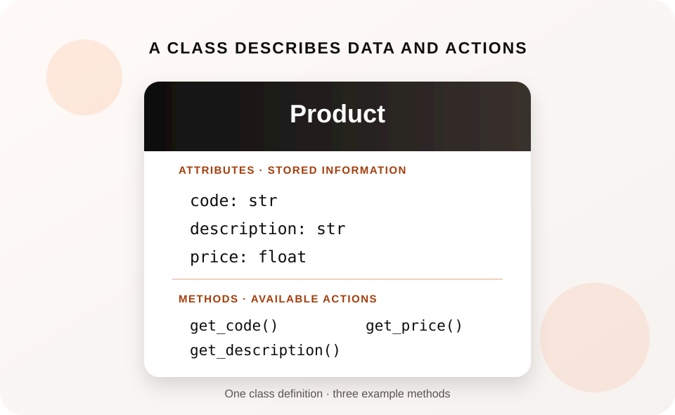
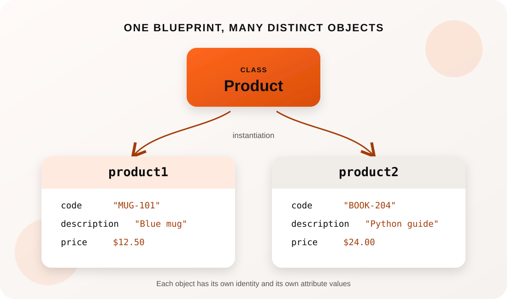

# Activity 3: RPG (Role-Playing Game) Character Forge (Student Guide)

## Professional Skills You're Building

The character is just the example. The broader skill is learning how to design software that
represents information and the work performed on it. Programmers use these ideas in many kinds of
systems—for example, a shopping application may represent products and orders, while a scheduling
tool may represent appointments and users.

In this activity, you will practice how to:

- **Break a problem into meaningful parts:** identify related information and behavior, then model
  them together in a class.
- **Write organized, reusable code:** use methods to give objects clear responsibilities instead
  of scattering related operations across a program.
- **Understand and manage program state:** trace how data changes as a program runs and keep the
  program's behavior consistent with that data.
- **Save and retrieve information:** use file input/output so data can be used again after a
  program closes.
- **Read, test, debug, and explain code:** follow how pieces of a program work together, check
  their results, and use errors as clues when something goes wrong.

These skills provide a foundation for contributing to larger programs, understanding unfamiliar
code, and communicating how a solution works. Building an RPG character is simply our hands-on way
to practice them.

## Put Your Skills to Work: Résumé and Portfolio

Completing this activity gives you a small project you can describe as coursework or include in a
beginner portfolio. Present it accurately as a **course project**, not as job experience, and only
claim features you personally completed and can explain.

**Résumé example** — adapt this to match your finished program:

> **Character Manager | Python Course Project**
> Built a Python application using a custom class to organize related data and behavior; implemented
> methods to update and display object state, and added file input/output to save and reload data.

If you have not completed the save/load features, leave that claim out. Replace general wording
with specific details from your version—for example, validation you added, tests you wrote, or an
extension you implemented.

**GitHub or portfolio suggestions:**

- Create your own repository and add a `README.md` explaining the purpose, features, Python version,
  and how to run the program.
- Include a short example of the program's output and describe what you implemented and learned.
  A screenshot is optional; clear text output is enough for a console program.
- Make the code easy to run and review. Use clear filenames, remove personal or machine-specific
  data, and do not commit temporary save files unless they contain deliberately prepared sample data.
- Make small, meaningful commits as you work. If you add tests or a feature of your own, explain
  that in the README.
- Share only code you wrote or are permitted to share. Do not upload textbook listings, instructor
  solutions, or classmates' work.

Before listing it publicly, run the program from a clean copy of the repository and check that the
README instructions work. Be ready to explain how your class, objects, methods, and save/load flow
work; a small project is most valuable when you can discuss your decisions and what you learned.

## Assigned Reading

Use the second edition of *Murach's Python Programming*:

- **Classes and objects (core reading):** Section 3, Chapter 14, pages 374–413. Pay special
  attention to the class diagrams on page 374, the `Product` class on pages 376–377, and the object
  creation example beginning on page 378. These are the ideas practiced in TODOs 1–4.
- **File I/O (Week 7 preparation):** Chapter 7, pages 202–210. Read the introduction to file I/O
  and the sections on opening/closing files and writing and reading text files. This supports
  TODOs 5–6; file I/O is outside Section 3.

Chapter 14 is the class-and-object foundation for this activity. Chapters 15–16 in Section 3 go
further into inheritance and object-oriented design, which are not required for the core TODOs.
The `FileNotFoundError` handling in TODO 6 also uses exception-handling knowledge from earlier
material; review that as needed.

Over two class sessions you'll build a `Character` class for a simple RPG, then make it so your
character is saved to a file and can be loaded back later. This is your first time writing your own
class, so take it slow — ask AI to explain any term you don't recognize, but write the class yourself.

## What You're Building

- **Week 6:** A `Character` class with attributes (name, hp, level, inventory) and methods (take
  damage, level up, display stats).
- **Week 7:** The ability to save your character to a file and load it back later, so it isn't lost
  when the program closes.

## Understanding the Character Data

You do not need prior role-playing game experience for this activity. Here is what the character's
data means in our simplified game:

- **Name:** the character's chosen name.
- **HP (hit points):** a number representing the character's health. Taking damage lowers the
  current HP, and this activity does not let it drop below zero.
- **Maximum HP (`max_hp`):** the character's health limit. In this activity, it starts at the
  character's initial HP and is restored when the character levels up.
- **Level:** a number representing the character's progress. The `level_up` method increases it by
  one.
- **Inventory:** a list of items the character carries. It starts empty; you can add items as an
  extension.
- **Damage:** an amount subtracted from current HP by the `take_damage` method.

These are common game terms, but games can define them differently. For this program, use the
rules above; the goal is to practice organizing and changing data, not to know a particular game's
rules.

## 1. What Is a Class?

A *class* is a definition that describes a kind of object: the information it can store and the
actions it can perform. Throughout this guide, *italicized terms* are important vocabulary to learn.

The diagram below is an original illustration of a `Product` class. It shows *attributes* in the
upper section and three *methods* in the lower section.

The attributes `code`, `description`, and `price` describe information associated with a product.
The three methods—`get_code()`, `get_description()`, and `get_price()`—are operations defined as
part of the class. A *method* is a function that belongs to a class. A regular *function* can be
defined on its own; a method is defined in a class and is normally called through an object made
from that class.

The words *parameter* and *argument* do not have different meanings for methods and regular
functions. A parameter is a name in a function or method definition; an argument is the value
supplied when it is called. For example, in `take_damage(self, amount)`, `amount` is a parameter.
In `hero.take_damage(5)`, `5` is an argument. A method also has `self` as its first parameter,
which refers to the object the method is working with.

This is a fundamental shift from the *procedural programming* we've practiced so far. In procedural
programming, data is passed between a series of functions. With object-oriented programming, we
group related variables as attributes and related functions as methods in a structure called an
*object*. The class describes what objects of that kind can store and do.

## 2. Creating Objects from a Class

One class can be used to create many objects. In the next diagram, `product1` and `product2` are
two objects created from the `Product` class. This process is called *instantiation*—creating an
object from a class. Each object has its own values for the class's attributes. This diagram focuses
on those values, so it shows attributes but leaves out methods.

Here, `product1` and `product2` are separate *instances* of the `Product` class. An *instance* is
another name for an object created from a class. Each instance has its own `code`, `description`,
and `price` values; changing one object's price does not automatically change the other's.

You can think of a class as a little like a spreadsheet's column layout, and each object as a row
of values: `code`, `description`, and `price` line up with columns. That's a useful starting
analogy, but it is not exact. A class is not a table, and an object is not literally a database
row: objects can also use the methods defined by their class, and they have their own identity in
the running program.

An object has an *identity* (it is a distinct object, separate from other objects), a *state* (the
data represented by its current attribute values), and *behavior* (the operations available through
its class's methods). Python manages an object's identity; you generally do not need to know its
memory address. As the program runs, a method may change an object's state—for example, lowering a
character's `hp` after taking damage.

## 3. Read and Explore a Product Class

Keep page 377 of *Murach's Python Programming* open alongside the original companion program,
`code/product_class_demo.py`, and run the companion with `python code/product_class_demo.py`.
Read pages 376–377 while the program is open. Compare the ideas and structure; use the book as a
reading reference rather than copying its listing.

In both the textbook example and the companion, look for the `dataclass` import and the
`@dataclass` line immediately above `class Product`. The `@dataclass` decorator tells Python to
provide helpful class features, including an initializer based on the annotated attributes. In the
companion program, trace how each `Product` object gets its own attribute values, how
`discount_amount()` uses those values, and how `sale_price()` calls another method on the same
object.

As you read, point to the class definition, its attributes, each method, each place an object is
created, and each method call. Notice that `product1` and `product2` have separate values even
though they are created from the same class.

## Setup

1. Open `code/character_forge_starter.py` in VS Code.
2. Run it once as-is: `python code/character_forge_starter.py` — it won't do much yet, that's expected.
3. Work through the `# TODO` comments in order (TODOs 1–4 in Week 6, TODOs 5–6 in Week 7).

## Week 6 TODOs

- **TODO 1:** Write `__init__(self, name, hp, level)` to set `self.name`, `self.hp`, `self.level`, and
  `self.inventory = []`.
- **TODO 2:** Write `take_damage(self, amount)` — reduce `self.hp`, but don't let it go below 0.
- **TODO 3:** Write `level_up(self)` — increase `self.level` by 1 and restore `self.hp` to its max.
- **TODO 4:** Write `display_stats(self)` — print the character's name, hp, level, and inventory.

## Week 7 TODOs

- **TODO 5:** Write `save_to_file(self, filename)` — a method on `Character` that writes `name`, `hp`,
  and `level` to a text file (one per line works fine).
- **TODO 6:** Write `load_character(filename)` — a standalone function that reads the file back and
  returns a new `Character` built from those values. Use `try`/`except FileNotFoundError` so it doesn't
  crash if no save file exists yet.

## Using AI the Right Way

Good use of AI in this activity:

- "Explain the difference between a class and an object using a real-world analogy."
- "Explain the difference between a function and a method."
- "I keep getting `NameError: name 'self' is not defined` — what does `self` mean and why do I need it?"
- "What's the difference between file mode `'w'` and `'a'`?"

Not the point of this activity:

- Asking AI to write your whole `Character` class. This is your first class ever — the point is to
  build the mental model of "attributes + methods" yourself, with AI as a tutor for concepts you get
  stuck on, not a code generator for the whole thing.

**Rule of thumb:** if you don't understand a term (class, object, attribute, method, constructor,
`self`), ask AI to explain *the concept* before you ask it to help with *your code*.

## Stretch Goals (if you finish early)

- Save/load your `inventory` list too, not just name/hp/level.
- Create a `Wizard(Character)` or `Warrior(Character)` subclass with one special method.
- Support saving more than one character to the same file.

## Vocabulary Recap

| Term | Meaning |
|---|---|
| Class | A blueprint for creating objects (defines attributes and methods) |
| Object / instance | A specific thing created from a class |
| Attribute | A piece of data stored on an object (e.g. `self.hp`) |
| Method | A function that belongs to a class |
| `__init__` | The constructor — runs automatically when you create a new object |
| File I/O | Reading from and writing to files on disk |
| `with open(...)` | The standard way to open a file so it closes automatically |
